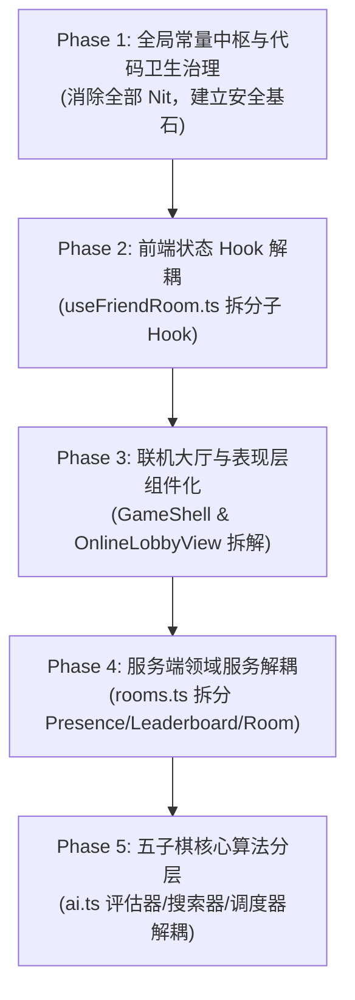

# 交接文档：全量代码审查技术债与代码卫生分阶段重构蓝图 (Master Refactoring Plan Handoff)

- **交付日期**：2026-09-13
- **文档性质**：全局阶段性规划与分阶段交接总纲（Master Plan Handoff）
- **依据输入**：[`docs/code-review-2026-09-10.md`](../code-review-2026-09-10.md) 与 [`docs/code-review-2026-09-10-followup.md`](../code-review-2026-09-10-followup.md)
- **执行方式**：**一次制作一个阶段**；每个阶段为一个自治闭环，完成后通过新窗口继续推进后续阶段。

---

## 1. 重构背景与目标

在 2026-09-10 代码审查中，所有的 Major 级功能缺陷（M1~M7）、Minor 缺陷（m1~m17）及复审副作用（R1~R5, R7~R8）已全部修复闭环，目前全仓 26 套测试套件、228 项单测全绿。

审查报告指出，项目当前最核心的工程挑战在于**残留的代码气味（Nit）**以及**四大上帝模块（God Modules）的技术债**：
1. `src/server/rooms.ts`（2360 行）：混杂状态机、持久化编排、在线 Presence、聊天与天梯榜单。
2. `src/components/useFriendRoom.ts`（1731 行）：单一 Hook 导出 60+ 字段，强行管理 10 个业务域。
3. `src/components/GameShell.tsx`（939 行）与 `OnlineLobbyView.tsx`（873 行）：UI 与 AI 编排耦合，Props 深层钻透。
4. `src/game/ai.ts`（2575 行）：棋型评估、$\alpha\text{-}\beta$ 搜索与开局策略调度混杂。

本规划将上述全部遗留问题拆解为 **5 个高内聚、低耦合的渐进阶段**。

---

## 2. 审查文档遗留项与阶段映射矩阵

| 审查报告来源项 | 问题描述与代码位置 | 所属重构阶段 | 解决方式与预期目标 |
| :--- | :--- | :--- | :--- |
| **Nit: 魔法值分散** | 分页 limit (20/30/10/50)、聊天 160、昵称 24、棋盘 15、Socket sweep 10s、复制反馈 1800ms 等分散硬编码 | **Phase 1** | 抽取统一的 `src/lib/constants.ts` 集中管理 |
| **Nit: 主题脚本重复** | `(root)/layout.tsx:15-21` 与 `[locale]/layout.tsx:26-32` 内联脚本完全相同，且 root 硬编码 `lang="en"` | **Phase 1** | 抽取 `src/components/ThemeScript.tsx` 组件复用 |
| **Nit: 部署文案与默认名** | `useFriendRoom.ts:1503` 错误信息硬编码部署说明；`:1482` 硬编码多语言默认名 | **Phase 1** | 收敛至 `dictionaries.ts` 与统一默认配置 |
| **Nit: 多标签页访客隔离** | `useFriendRoom.ts:1316` 存 `sessionStorage` 导致多标签页各自生成访客 ID | **Phase 1** | 规范存储行为，补充边界防御机制与文档说明 |
| **Nit: 规则假设明示** | 全仓采用五子棋无禁手规则（`board.ts:140`、`ai.ts:1630` `>=5` 判胜） | **Phase 1** | 在架构文档与 README 明示自由五子棋假设 |
| **巨石 1: 大 Hook 膨胀** | `useFriendRoom.ts`（1731 行）单 Hook 承载 60+ 字段与 10 个业务域；R6 快照模块级 `let` | **Phase 2** | 拆分为 `useRoomSocket`、`useRoomChat`、`useLobbyPresence`、`useRoomGame`；快照挪入实例作用域 |
| **巨石 2: 表现层耦合** | `GameShell.tsx`（939 行）耦合 AI 编排；`OnlineLobbyView.tsx`（873 行）12 个子组件且 Props 钻透 | **Phase 3** | `GameShell` 抽离 `useAiGame`；`OnlineLobbyView` 拆分文件树并引入 `RoomContext` |
| **巨石 3: 服务端混杂** | `rooms.ts`（2360 行）耦合房间生命周期、Presence、聊天与天梯 | **Phase 4** | 拆解为 `PresenceTracker`、`LeaderboardService`、`RoomStateMachine` 三大领域服务 |
| **巨石 4: AI 算法耦合** | `ai.ts`（2575 行）评估函数、极小极大搜索、开局库调度混杂 | **Phase 5** | 拆分为纯计算评估器 `ai-evaluator.ts`、搜索器 `ai-search.ts`、开局策略调度 `ai-scheduler.ts` |

---

## 3. 分阶段详细实施规划（Phase 1 ~ Phase 5）

### 🎯 Phase 1: 全局常量中枢与代码卫生治理 (Low Risk, Foundation)
- **目标**：彻底解决审查报告列出的所有 Nit 项，不破坏任何现有业务逻辑与核心时序。
- **具体实施范围**：
  1. **新建 `src/lib/constants.ts`**：
     - 棋盘与落子：`BOARD_SIZE = 15`，`WIN_STONE_COUNT = 5`；
     - 限制常数：`MAX_CHAT_MESSAGE_LENGTH = 160`，`MAX_PLAYER_NAME_LENGTH = 24`；
     - 时序与超时：`DEFAULT_ROOM_SWEEP_INTERVAL_MS = 10_000`，`CHAT_ACK_TIMEOUT_MS = 8000`，`LEAVE_ROOM_TIMEOUT_MS = 8000`，`DISCONNECT_GRACE_PERIOD_MS = 60_000`，`COPY_FEEDBACK_DURATION_MS = 1800`；
     - 分页配置：`PAGINATION_LIMITS = { LOBBY_ROOMS: 20, LEADERBOARD: 30, RECORDS: 10, PROFILE: 50 }`；
     - 替换 `GomokuBoard.tsx`、`TableRoomChat.tsx`、`OnlineLobbyView.tsx`、`useFriendRoom.ts`、`PlayerProfilePage.tsx`、`room-socket.ts`、`TableSidebarTabs.tsx` 中的硬编码。
  2. **新建 `src/components/ThemeScript.tsx`**：
     - 抽取内联防白屏脚本组件，并在 `(root)/layout.tsx` 与 `[locale]/layout.tsx` 中复用。
  3. **收敛默认名称与部署说明**：
     - 规范 `DEFAULT_PLAYER_NAME` 与多语言 fallback；
     - 整理 `README.md` 与文档，明示自由规则（无禁手，长连亦胜）的设计假设。
- **验证手段**：`npx tsc --noEmit`、`npm run lint`、`npm test`、`npm run build`。
- **交付产物**：`docs/handoff/YYYY-MM-DD-phase1-code-hygiene-handoff.md`。

---

### 🎯 Phase 2: 前端状态 Hook 解耦 (`src/components/useFriendRoom.ts`)
- **目标**：将 1731 行的大型上帝 Hook 拆解为单一职责的专注 Hook，解决 R6 模块级快照缺陷。
- **架构拆解方案**：
  1. `src/components/hooks/useRoomSocket.ts`：负责 Socket.IO 实例单例管理、握手鉴权、重连时序、断线看门狗。
  2. `src/components/hooks/useRoomChat.ts`：集成 `chat-send-gate.ts`，管理房间公聊/私聊的发送状态、在途闸门与输入框回填。
  3. `src/components/hooks/useLobbyPresence.ts`：管理大厅房间列表、在线人数/对局数单调版本增量消费与跳号全量同步。
  4. `src/components/hooks/useRoomGame.ts`：管理对局核心状态（落子、悔棋在途确认、重开、投降、倒计时）。
  5. `useFriendRoom.ts` 蜕变为顶层装配器，组合上述子 Hook，保持对上层组件的导出 API 接口 100% 兼容。
  6. **解决 R6**：将 4 个模块级 `boot*Cache` 改造为 Hook 实例级 `useRef`，消除跨会话生命周期污染。
- **验证手段**：运行 `npm test`（现有 26 套测试套件保证行为一致）+ 联机大厅/房间 Smoke 脚本。
- **交付产物**：`docs/handoff/YYYY-MM-DD-phase2-usefriendroom-decomp-handoff.md`。

---

### 🎯 Phase 3: 联机大厅与表现层组件化 (`OnlineLobbyView.tsx` & `GameShell.tsx`)
- **目标**：消除万能数据包多层 Props 钻透与组件巨石，优化 React 19 渲染性能。
- **架构拆解方案**：
  1. **新建 `src/components/online/RoomContext.tsx`**：
     - 将房间与大厅状态收敛入 Context，子组件按需消费，彻底消除 `FriendRoomController` 逐层 props 钻透。
  2. **拆解 `src/components/online/lobby/` 子组件目录**：
     - 独立拆出 `LobbyHeader.tsx`（大厅实时统计指标栏）；
     - 独立拆出 `LobbyRoomList.tsx`（公开房间列表与卡片）；
     - 独立拆出 `LobbyPublicChat.tsx`（公共聊天大厅）；
     - 独立拆出 `LobbyLeaderboard.tsx`（排行榜与天梯积分）。
  3. **抽离 `src/components/hooks/useAiGame.ts`**：
     - 从 `GameShell.tsx`（939 行）中抽离 AI Web Worker 调度、难度配置、AI 悔棋与超时逻辑，使 `GameShell.tsx` 纯粹聚焦于页面布局与模式路由切换。
- **验证手段**：`npm run lint` + `npm run build` + `npm run smoke:lobby-ui`。
- **交付产物**：`docs/handoff/YYYY-MM-DD-phase3-frontend-ui-decomp-handoff.md`。

---

### 🎯 Phase 4: 服务端领域解耦 (`src/server/rooms.ts`)
- **目标**：将 2360 行的服务端单文件拆分为高内聚的微领域服务，严格保持单调递增版本协议。
- **架构拆解方案**：
  1. `src/server/domain/presence-tracker.ts`：
     - 独立管理连接、断开、无分页 Presence Map、版本号指纹生成与心跳清扫。
  2. `src/server/domain/leaderboard-service.ts`：
     - 独立负责胜率计算、天梯积分排行、分页查询与缓存刷新。
  3. `src/server/domain/room-state-machine.ts`：
     - 纯房间生命周期管理（创建、加入、准备、落子合法性校验、胜负判定、60s 断线保留）。
  4. `src/server/rooms.ts` 蜕变为外层外观门面（Facade Pattern），无缝对接 `room-socket.ts`。
- **验证手段**：`npm run verify:online` + `npm test`（`rooms.test.ts` 43 项测试全绿）。
- **交付产物**：`docs/handoff/YYYY-MM-DD-phase4-server-rooms-decomp-handoff.md`。

---

### 🎯 Phase 5: 五子棋核心算法分层 (`src/game/ai.ts`)
- **目标**：将 2575 行的 AI 启发式引擎解耦为纯函数式分层体系，确保棋力稳定且可单独优化。
- **架构拆解方案**：
  1. `src/game/ai-evaluator.ts`：
     - 纯棋盘静态评估模型：方向扫描（成五、活四、冲四、活三、眠三）、窗口威胁统计、Zobrist 哈希计算。
  2. `src/game/ai-search.ts`：
     - 搜索核心：$\alpha\text{-}\beta$ 剪枝、置换表缓存、迭代加深、根节点候选排序与分片策略。
  3. `src/game/ai-scheduler.ts`：
     - 战术制胜/必挡判定、开局库加权匹配、四档难度（Normal/Hard/Expert/Insane）搜索深度与时间门控。
  4. 保持 `src/game/ai-worker-pool.ts` 线程复用池接口不变。
- **验证手段**：
  - `npm test` 单元测试通过；
  - `npm run arena`：运行天梯对战评测，确保各难度胜率与棋力评估基线不降。
- **交付产物**：`docs/handoff/YYYY-MM-DD-phase5-ai-engine-decomp-handoff.md`。

---

## 4. 单阶段执行与新窗口接手协议（Workflow Protocol）

后续在新窗口执行每个阶段时，请遵循以下标准化工作流：

1. **在新窗口开始时**：
   - 检查并执行 `git pull --ff-only`；
   - 阅读 `STATUS.md` 与本交接单（`docs/handoff/2026-09-13-comprehensive-refactoring-master-plan-handoff.md`）；
   - 锁定当前目标阶段（如 Phase 1）。
2. **执行与门禁验证**：
   - 仅修改该阶段受控范围内的文件；
   - 按序执行四道门禁：`tsc --noEmit` ➔ `npm run lint` ➔ `npm test` ➔ `npm run build`。
3. **沉淀与交付**：
   - 产出该阶段专属交接单：`docs/handoff/YYYY-MM-DD-phaseN-*-handoff.md`；
   - 更新 `docs/handoff/INDEX.md` 与 `STATUS.md`；
   - 规范语义化提交并推送远端 `git push origin main`。
