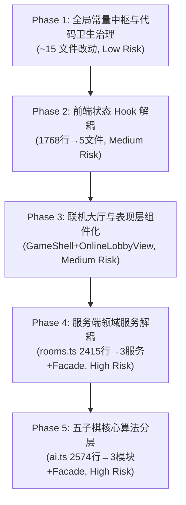

# 交接文档：全量代码审查技术债与代码卫生分阶段重构蓝图 (Master Refactoring Plan Handoff)

- **交付日期**：2026-09-13
- **最后验证更新**：2026-09-13（源码级逐项交叉验证，修正行数/字段数偏差，补充精确代码位置与消费者影响分析）
- **文档性质**：全局阶段性规划与分阶段交接总纲（Master Plan Handoff）
- **依据输入**：[`docs/code-review-2026-09-10.md`](../code-review-2026-09-10.md) 与 [`docs/code-review-2026-09-10-followup.md`](../code-review-2026-09-10-followup.md)
- **执行方式**：**一次制作一个阶段**；每个阶段为一个自治闭环，完成后通过新窗口继续推进后续阶段。

---

## 1. 重构背景与目标

在 2026-09-10 代码审查中，所有的 Major 级功能缺陷（M1~M7）、Minor 缺陷（m1~m17）及复审副作用（R1~R5, R7~R8）已全部修复闭环，目前全仓 26 套测试套件、228 项单测全绿。

审查报告指出，项目当前最核心的工程挑战在于**残留的代码气味（Nit）**以及**四大上帝模块（God Modules）的技术债**：
1. `src/server/rooms.ts`（**2415 行**）：混杂状态机、持久化编排、在线 Presence、聊天与天梯榜单。
2. `src/components/useFriendRoom.ts`（**1768 行**）：单一 Hook 导出 **79 个字段**，强行管理 10 个业务域。
3. `src/components/GameShell.tsx`（**973 行**）与 `OnlineLobbyView.tsx`（**888 行**）：UI 与 AI 编排耦合，Props 深层钻透。
4. `src/game/ai.ts`（**2574 行**）：棋型评估、$\alpha\text{-}\beta$ 搜索与开局策略调度混杂。

本规划将上述全部遗留问题拆解为 **5 个高内聚、低耦合的渐进阶段**。

---

## 2. 审查文档遗留项与阶段映射矩阵

| 审查报告来源项 | 问题描述与代码位置 | 所属重构阶段 | 解决方式与预期目标 |
| :--- | :--- | :--- | :--- |
| **Nit: 魔法值分散** | 分页 limit (20/30/10/50)、聊天 160、昵称 24、棋盘 15、Socket sweep 10s、复制反馈 1800ms 等分散硬编码 | **Phase 1** | 抽取统一的 `src/lib/constants.ts` 集中管理 |
| **Nit: 主题脚本重复** | `(root)/layout.tsx:17-21` 与 `[locale]/layout.tsx:28-32` 内联脚本**字符级相同** | **Phase 1** | 抽取 `src/components/ThemeScript.tsx` 组件复用 |
| **Nit: 部署文案与默认名** | `useFriendRoom.ts:172-173` 错误信息硬编码部署说明；`:178` 硬编码英文默认名 | **Phase 1** | 收敛至 `dictionaries.ts` 与统一默认配置 |
| **Nit: 多标签页访客隔离** | `useFriendRoom.ts:1576-1593` 存 `sessionStorage` 导致多标签页各自生成访客 ID | **Phase 1** | 规范存储行为，补充边界防御机制与文档说明 |
| **Nit: 规则假设明示** | 全仓采用五子棋无禁手规则（`board.ts:140`、`ai.ts:1633` `>=5` 判胜） | **Phase 1** | 在架构文档与 README 明示自由五子棋假设 |
| **巨石 1: 大 Hook 膨胀** | `useFriendRoom.ts`（1768 行）单 Hook 承载 **79 个字段**与 10 个业务域；R6 快照模块级 `let` | **Phase 2** | 拆分为 `useRoomSocket`、`useRoomChat`、`useLobbyPresence`、`useRoomGame`；快照挪入实例作用域 |
| **巨石 2: 表现层耦合** | `GameShell.tsx`（973 行）耦合 AI 编排 ~190 行；`OnlineLobbyView.tsx`（888 行）6 个内联面板且 Props 钻透 3-4 层 | **Phase 3** | `GameShell` 抽离 `useAiGame`；`OnlineLobbyView` 拆分文件树并引入 `RoomContext` |
| **巨石 3: 服务端混杂** | `rooms.ts`（2415 行）耦合房间生命周期、Presence、聊天与天梯，35+ 公开方法 | **Phase 4** | 拆解为 `PresenceTracker`、`LeaderboardService`、`RoomStateMachine` 三大领域服务 + Facade |
| **巨石 4: AI 算法耦合** | `ai.ts`（2574 行）评估函数、极小极大搜索、开局库调度混杂，11 个 export + 65 个内部函数 | **Phase 5** | 拆分为纯计算评估器 `ai-evaluator.ts`、搜索器 `ai-search.ts`、开局策略调度 `ai-scheduler.ts` + Facade |

---

## 3. 分阶段详细实施规划（Phase 1 ~ Phase 5）



---

### 🎯 Phase 1: 全局常量中枢与代码卫生治理 (Low Risk, Foundation)

- **目标**：彻底解决审查报告列出的所有 Nit 项，不破坏任何现有业务逻辑与核心时序。

#### 3.1.1 新建 `src/lib/constants.ts` — 统一魔法值常量

```typescript
// ─── 棋盘与规则 ───
export const BOARD_SIZE = 15;
export const WIN_STONE_COUNT = 5;

// ─── 长度限制 ───
export const MAX_CHAT_MESSAGE_LENGTH = 160;
export const MAX_PLAYER_NAME_LENGTH = 24;

// ─── 分页配置 ───
export const PAGINATION = {
  LOBBY_ROOMS: 20,
  PRESENCE_USERS: 30,
  LEADERBOARD: 10,
  PLAYER_PROFILE_RECORDS: 50,
} as const;

// ─── 时序与超时 ───
export const LIFECYCLE_SWEEP_INTERVAL_MS = 10_000;
export const COPY_FEEDBACK_DURATION_MS = 1_800;
export const DISCONNECT_GRACE_MS = 60_000;
export const EMPTY_ROOM_GRACE_MS = 60_000;
// 注：CHAT_ACK_TIMEOUT_MS (8_000) 已在 chat-send-gate.ts:15 定义，保持不动
// 注：LEAVE_ROOM_TIMEOUT_MS (8_000) 已在 leave-room-attempt.ts:8 定义，保持不动
```

##### 精确替换点位表

| 魔法值 | 文件 | 行号 | 当前代码 | 替换为 |
| :--- | :--- | :--- | :--- | :--- |
| `160` | `src/server/rooms.ts` | L333 | `const MAX_ROOM_CHAT_TEXT_LENGTH = 160` | 引用 `MAX_CHAT_MESSAGE_LENGTH` |
| `160` | `src/components/online/OnlineLobbyView.tsx` | L595 | `maxLength={160}` | `maxLength={MAX_CHAT_MESSAGE_LENGTH}` |
| `160` | `src/components/online/TableRoomChat.tsx` | L43 | `maxLength={160}` | `maxLength={MAX_CHAT_MESSAGE_LENGTH}` |
| `24` | `src/server/accounts.ts` | L83, L521 | `const MAX_DISPLAY_NAME_LENGTH = 24` | 引用 `MAX_PLAYER_NAME_LENGTH` |
| `24` | `src/components/online/OnlineLobbyView.tsx` | L96 | `maxLength={24}` | `maxLength={MAX_PLAYER_NAME_LENGTH}` |
| `20` | `src/components/useFriendRoom.ts` | L636 | `{ limit: 20 }` | `{ limit: PAGINATION.LOBBY_ROOMS }` |
| `30` | `src/components/useFriendRoom.ts` | L679 | `{ ...player, limit: 30 }` | `{ ...player, limit: PAGINATION.PRESENCE_USERS }` |
| `10` | `src/components/useFriendRoom.ts` | L168 | `const LEADERBOARD_PAGE_SIZE = 10` | 引用 `PAGINATION.LEADERBOARD` |
| `"10"` | `src/components/useFriendRoom.ts` | L757 | `limit: "10"` | `limit: String(PAGINATION.LEADERBOARD)` |
| `"50"` | `src/components/profile/PlayerProfilePage.tsx` | L50 | `limit: "50"` | `limit: String(PAGINATION.PLAYER_PROFILE_RECORDS)` |
| `50`/`20` | `src/server/game-records.ts` | L199, L319, L366 | `limit = 50` / `limit = 20` | 引用 `PAGINATION` |
| `/ 15` | `src/components/GomokuBoard.tsx` | L239-240 | `/ 15) * 100` | `/ BOARD_SIZE) * 100` |
| `10_000` | `src/server/room-socket.ts` | L198 | `options.lifecycleIntervalMs ?? 10_000` | 引用 `LIFECYCLE_SWEEP_INTERVAL_MS` |
| `1800` | `src/components/useFriendRoom.ts` | L1330 | `setTimeout(..., 1800)` | `setTimeout(..., COPY_FEEDBACK_DURATION_MS)` |
| `60_000` | `src/server/room-socket.ts` | L34 | `const EMPTY_ROOM_GRACE_MS = 60_000` | 引用统一常量 |
| `60 * 1000` | `src/server/rooms.ts` | L330 | `const DISCONNECT_GRACE_MS = 60 * 1000` | 引用统一常量 |

#### 3.1.2 新建 `src/components/ThemeScript.tsx` — 消除内联脚本重复

当前 `src/app/(root)/layout.tsx:17-21` 与 `src/app/[locale]/layout.tsx:28-32` 包含**字符级相同**的 `dangerouslySetInnerHTML` 内联脚本：

```js
(function(){try{var stored=localStorage.getItem("gomoku-theme");var theme=stored==="light"||stored==="dark"?stored:(matchMedia("(prefers-color-scheme: dark)").matches?"dark":"light");document.documentElement.dataset.theme=theme;}catch(e){document.documentElement.dataset.theme="light";}})();
```

解决方案：抽取为 `ThemeScript` 组件，两处 layout 文件改为 `<ThemeScript />`。

#### 3.1.3 收敛默认名称与部署文案

| 位置 | 行号 | 问题 | 处置 |
| :--- | :--- | :--- | :--- |
| `useFriendRoom.ts` | L172-173 | `DEFAULT_CONNECTION_XHR_ERROR` 硬编码英文部署说明 | 标注为开发态诊断信息或移至 `dictionaries.ts` |
| `useFriendRoom.ts` | L178 | `DEFAULT_PLAYER_NAME = "Player"` 硬编码英文 | 收敛至 `constants.ts` |
| `useFriendRoom.ts` | ~L1738 | `createGuestPlayerName()` 中 `` `Player ${randomNum}` `` | 同上 |

#### 3.1.4 规则假设文档化

在 `README.md` 中明确声明本项目采用**自由五子棋规则（Freestyle Gomoku）**：`>=5` 连珠即判胜（含长连），无黑棋禁手。代码证据：`board.ts:140` 和 `ai.ts:1633`。

- **验证手段**：`npx tsc --noEmit`、`npm run lint`、`npm test`、`npm run build`。
- **交付产物**：`docs/handoff/YYYY-MM-DD-phase1-code-hygiene-handoff.md`。

---

### 🎯 Phase 2: 前端状态 Hook 解耦 (`src/components/useFriendRoom.ts`)

- **目标**：将 **1768 行**的大型上帝 Hook 拆解为单一职责的专注 Hook，解决 R6 模块级快照缺陷。

#### 3.2.1 `FriendRoomController` 79 字段按领域分组

当前 `FriendRoomController` 接口定义于 `useFriendRoom.ts:62-142`，返回对象位于 `L1335-L1415`。79 个字段按业务域划分如下：

**🔌 Socket/连接管理 → `useRoomSocket.ts`（~8 字段）**

`connectionStatus` · `error` · `room` · `createRoom` · `joinRoom` · `joinListedRoom` · `leaveRoom` · `isJoiningRoom`

**👥 大厅/Presence/排行/匹配 → `useLobbyPresence.ts`（~30 字段）**

`lobbyActivity` · `lobbyRooms` · `lobbyStatus` · `presenceStatus` · `presenceUsers` · `leaderboard` · `leaderboardIdentity` · `leaderboardOffset` · `leaderboardSearch` · `leaderboardScope` · `leaderboardStatus` · `profile` · `profileStatus` · `previousGameRecord` · `previousGameRecordStatus` · `matchmakingStatus` · `refreshPresence` · `refreshLeaderboard` · `refreshProfile` · `refreshLobby` · `nextLeaderboardPage` · `previousLeaderboardPage` · `setLeaderboardIdentity` · `setLeaderboardSearch` · `setLeaderboardScope` · `submitLeaderboardSearch` · `findMatch` · `cancelMatch` · `canFindMatch` · `canCancelMatch` · `canCreateRoom` · `canJoinRoom`

**💬 聊天 → `useRoomChat.ts`（~10 字段）**

`chatText` · `setChatText` · `isSendingChat` · `sendChatMessage` · `publicChatMessages` · `publicChatText` · `setPublicChatText` · `publicChatStatus` · `isSendingPublicChat` · `sendPublicChatMessage` · `refreshPublicChat`

**♟️ 对局核心 → `useRoomGame.ts`（~12 字段）**

`playMove` · `canPlay` · `canReady` · `canRematch` · `canResign` · `canSit` · `canUndo` · `ready` · `toggleReady` · `rematchReady` · `setRematchReady` · `resignGame` · `respondUndoRequest` · `undoMove` · `sitRoom`

**👤 账户/身份（保留在顶层装配器，~10 字段）**

`account` · `accountStatus` · `playerName` · `setPlayerName` · `registrationHandle` · `setRegistrationHandle` · `registerAccount` · `signOutAccount` · `joinTarget` · `setJoinTarget` · `inviteUrl` · `copyInvite` · `copiedInvite`

#### 3.2.2 消除 R6：模块级 `let boot*Cache` → Hook 实例级 `useRef`

4 个模块级变量位于 `useFriendRoom.ts:L1505-L1538`：

```
L1505: let bootAccountStatusCache: FriendRoomController["accountStatus"] | null = null;
L1516: let bootPlayerNameCache: string | null = null;
L1527: let bootJoinTargetCache: string | null = null;
L1538: let bootIsJoiningRoomCache: boolean | null = null;
```

全部改为对应子 Hook 内的 `useRef`，消除跨会话/HMR 生命周期污染。

#### 3.2.3 文件结构规划

```
src/components/
├── hooks/
│   ├── useRoomSocket.ts      [NEW] ~200 行
│   ├── useRoomChat.ts        [NEW] ~150 行（引用 chat-send-gate.ts）
│   ├── useLobbyPresence.ts   [NEW] ~350 行
│   └── useRoomGame.ts        [NEW] ~200 行
├── useFriendRoom.ts          [MODIFY] 蜕变为顶层装配器 ~200 行
└── ...
```

#### 3.2.4 消费者影响分析（API 零破坏）

`useFriendRoom.ts` 保持为唯一导出口，`FriendRoomController` 类型接口不变。以下 6 个消费者**无需任何改动**：

| 消费者文件 | import 内容 |
| :--- | :--- |
| `GameShell.tsx:L35` | `useFriendRoom`, `FriendRoomController` |
| `GameTableView.tsx:L6` | `type FriendRoomController` |
| `OnlineLobbyView.tsx:L34` | `type FriendRoomController` |
| `TableRoomChat.tsx:L6` | `type FriendRoomController` |
| `TableSidebar.tsx:L4` | `type FriendRoomController` |
| `TableSidebarTabs.tsx:L8` | `type FriendRoomController` |

- **验证手段**：运行 `npm test`（26 套测试套件保证行为一致）+ `npm run verify:online`。
- **交付产物**：`docs/handoff/YYYY-MM-DD-phase2-usefriendroom-decomp-handoff.md`。

---

### 🎯 Phase 3: 联机大厅与表现层组件化 (`OnlineLobbyView.tsx` & `GameShell.tsx`)

- **目标**：消除万能数据包多层 Props 钻透与组件巨石，优化 React 19 渲染性能。

#### 3.3.1 从 `GameShell.tsx` 抽离 `useAiGame` Hook

`GameShell.tsx`（973 行）中 AI 编排代码约 **190+ 行**，深度耦合：

| 代码块 | 行号范围 | 职责 |
| :--- | :--- | :--- |
| AI 类型导入 | L6-L12 | `chooseAiMove`, `getAiTimeLimitMs`, `getAiWorkerCount`, `AiDifficulty`, `AiWorkerPool` |
| AI Worker 类型定义 | L49-L65 | `AiWorkerResponse`, `AiWorkerDoneResult` |
| AI 状态/Ref | L86-L96 | `aiDifficulty`, `pendingDifficulty`, `aiWorkersRef`, `aiWorkerPoolRef`, `aiWorkerTimeoutRef` |
| 难度切换 | L211-L220 | `handleDifficultyChange()` |
| Worker 调度核心 | L348-L539 | `commitAiTurn()`, `requestAiMove()`, `getAiWorkerPool()`, `terminateAiWorkers()`, `clearAiWorkerTimeout()` |
| Worker 结果处理纯函数 | L784-L834 | `normalizeAiWorkerResult()`, `isBetterAiWorkerResult()`, `isDecisiveAiWorkerResult()` |
| AI 首手预算 | L843-L861 | 开局 AI 先手逻辑 |

新建 `src/components/hooks/useAiGame.ts`，迁入上述逻辑。预计 `GameShell.tsx` 缩减至 ~750 行。

#### 3.3.2 `OnlineLobbyView.tsx` 拆分子组件

`OnlineLobbyView.tsx`（888 行）中内联定义了 6 个面板组件，全部接收完整的 `FriendRoomController`（79 字段）：

| 内联组件 | 实际消费字段数 | 目标独立文件 |
| :--- | :--- | :--- |
| `OnlineUsersPanel` (L263) | ~5 | `src/components/online/lobby/LobbyUsersPanel.tsx` |
| `RoomProfilePanel` (L309) | ~8 | `src/components/online/lobby/LobbyProfilePanel.tsx` |
| `LeaderboardPanel` (L391) | ~12 | `src/components/online/lobby/LobbyLeaderboard.tsx` |
| `PublicChatPanel` (L558) | ~6 | `src/components/online/lobby/LobbyPublicChat.tsx` |
| `RoomMatchmakingPanel` (L623) | ~4 | `src/components/online/lobby/LobbyMatchmaking.tsx` |
| `LobbyPanel` (L729) | ~8 | `src/components/online/lobby/LobbyRoomList.tsx` |

#### 3.3.3 新建 `RoomContext` 消除 Props 钻透

新建 `src/components/online/RoomContext.tsx`，消除 GameShell → OnlineLobbyView → 6 面板 以及 GameShell → GameTableView → TableSidebar → TableSidebarTabs 的逐层 `room: FriendRoomController` 透传。

- **验证手段**：`npm run lint` + `npm run build` + `npm run verify:online`。
- **交付产物**：`docs/handoff/YYYY-MM-DD-phase3-frontend-ui-decomp-handoff.md`。

---

### 🎯 Phase 4: 服务端领域解耦 (`src/server/rooms.ts`)

- **目标**：将 **2415 行**的服务端单文件拆分为高内聚的微领域服务，严格保持单调递增版本协议。

#### 3.4.1 `RoomStore` 35+ 公开方法按领域映射

**🟢 `src/server/domain/presence-tracker.ts` [NEW]**

| 方法 | 行号 | 职责 |
| :--- | :--- | :--- |
| `connectPresence()` | L1186 | 连接 Presence |
| `updatePresence()` | L1215 | 更新状态 |
| `disconnectPresence()` | L1243 | 断开 Presence |
| `listPresence()` | L1258 | 列表查询 |
| `getPresenceStatus()` | L1991 | 计算用户状态（私有） |
| `getPresenceStatusRank()` | L2023 | 状态排序（私有） |
| **内部状态** | L360-361 | `presences: Map`, `presenceVersion` |

**🟡 `src/server/domain/leaderboard-service.ts` [NEW]**

| 方法 | 行号 | 职责 |
| :--- | :--- | :--- |
| `submitGameRecord()` | L1319 | 提交对局记录 |
| `listGameRecords()` | L1345 | 列表战绩 |
| `getRoomGameRecord()` | L1349 | 获取房间记录 |
| `getLeaderboard()` | L1357 | 查询排行榜 |
| `getPlayerProfile()` | L1361 | 查询玩家档案 |
| **内部状态** | L352 | `gameRecordStore: GameRecordStore` |

**🔵 `src/server/domain/room-state-machine.ts` [NEW]**

| 方法 | 行号 | 职责 |
| :--- | :--- | :--- |
| `createRoom()` | L383 | 创建房间 |
| `findMatch()` | L451 | 快速匹配 |
| `joinRoom()` | L476 | 加入房间 |
| `sitPlayer()` | L535 | 入座 |
| `reconnectRoom()` | L602 | 重连 |
| `setPlayerReady()` | L638 | 设置准备 |
| `startGame()` | L658 | 开始游戏 |
| `applyMove()` | L674 | 落子 |
| `resignGame()` | L725 | 认输 |
| `requestUndo()` | L750 | 请求悔棋 |
| `respondToUndo()` | L802 | 响应悔棋 |
| `restartGame()` | L859 | 重开 |
| `setRematchReady()` | L882 | 重赛准备 |
| `markDisconnected()` | L912 | 标记断线 |
| `leaveRoom()` | L973 | 离开房间 |
| `sendRoomChat()` | L1014 | 房间聊天 |
| `restoreConnection()` | L1058 | 恢复连接 |
| `sweepExpiredRooms()` | L1479 | 清扫过期房间 |
| `deleteRoom()` | L1544 | 删除房间 |
| 辅助查询 | L1080-L1540 | `getSnapshot`, `listRooms`, `getLobbyActivitySummary`, `listPublicChatMessages`, `getPlayerSeat`, `getParticipantRole`, `leaveParticipantRooms`, `leaveDisposableWaitingRoomsByParticipantName`, `getLobbyVersion`, `getRoomListItem`, `listRoomCodes` |

**`rooms.ts` 蜕变为 Facade（~300 行）**：代理全部 35+ 方法，保持 `RoomStore` 类签名不变。所有 31 个 `export type`（L17-L246）保持从 `rooms.ts` 重导出。

#### 3.4.2 消费者影响分析

| 消费者 | 调用方式 | 影响 |
| :--- | :--- | :--- |
| `room-socket.ts`（1307 行） | `roomStore.xxx()` 调用 35+ 方法 | Facade 代理，**零改动** |
| `rooms.test.ts`（43 项测试） | `new RoomStore()` + 方法调用 | 构造函数和方法签名不变，**零改动** |
| `useFriendRoom.ts` | import types | 类型导出不变，**零改动** |

- **验证手段**：`npm run verify:online` + `npm test`（`rooms.test.ts` 43 项测试全绿）+ `npm run smoke:lobby` + `npm run smoke:matchmaking`。
- **交付产物**：`docs/handoff/YYYY-MM-DD-phase4-server-rooms-decomp-handoff.md`。

---

### 🎯 Phase 5: 五子棋核心算法分层 (`src/game/ai.ts`)

- **目标**：将 **2574 行**的 AI 启发式引擎解耦为纯函数式分层体系，确保棋力稳定且可单独优化。

#### 3.5.1 `ai.ts` 11 个 export + 65 个内部函数按模块划分

**📊 `src/game/ai-evaluator.ts` [NEW] — 棋盘静态评估（~700 行）**

- **公开 export**：`evaluateBoard()` (L501)、`scoreAiMove()` (L481)、`getThreatSummaryAfterMove()` (L1889)
- **棋型评估**：`scoreBoardForStone` (L2275)、`scoreWindow` (L2320)、`scorePattern` (L2402)、`scoreWindowsThroughPoint` (L2293)、`scoreStonePlacement` (L2360)、`countDirection` (L2378) 等
- **威胁分析**：`getThreatSummaryForPlacedStone` (L1899)、`addWindowThreatsThroughPoint` (L1929)、`addWindowThreat` (L1951)、`getWindowOpenEnds` (L1990)、`createThreatSummary` (L2012)、`hasForcingThreat` (L2022)、`getThreatScore` (L2026)、`getCappedThreatScore` (L2049)
- **Zobrist 哈希**：`createZobristStoneTable` (L2454)、`splitMix32` (L2477)、`getBoardHash` (L2485)、`addStoneHash` (L2503)、`addStoneHashLock` (L2507)、`getTranspositionKey` (L2511)、`getTranspositionLock` (L2515)
- **坐标工具**：`getPointKey` (L2519)、`getPointIndex` (L2523)、`pointFromIndex` (L2527)、`isInBoundsForSize` (L2534)
- **评估窗口**：`createEvaluationWindows` (L2538)、`createWindowsByCell` (L2556)
- **常量**：`DIRECTIONS` (L158)、评分常量 `WIN_SCORE`...`DOUBLE_OPEN_THREE_SCORE` (L254-L261)、Zobrist 表 (L262-L271)

**🔍 `src/game/ai-search.ts` [NEW] — $\alpha\text{-}\beta$ 搜索引擎（~900 行）**

- **搜索核心**：`minimax()` (L1065-L1354, ~290 行)、`extendTacticalSearch()` (L1259)、`chooseSearchMove()` (L964)、`chooseBestMove()` (L2121)
- **候选生成/排序**：`getCandidateMoves()` (L512)、`orderCandidateMoves` (L2156)、`rankCandidateMoves` (L2165)、`getCandidateTier` (L2199)、`getMoveOrderingScore` (L2235)
- **搜索位置函数**：`findWinningMovesInPosition` (L1362)、`findBestOpenFourMoveInPosition` (L1382)、`getTacticalCandidateMovesInPosition` (L1417)、`orderCandidateMovesInPosition` (L1460)、`rankCandidateMovesInPosition` (L1470)、`getMoveOrderingScoreInPosition` (L1505)、`scoreAiMoveInPosition` (L1522)、`scorePointForStoneInPosition` (L1547)、`getThreatSummaryAfterMoveInPosition` (L1559)
- **置换表**：`cacheSearchScore` (L2053)、`findTranspositionEvictionKey` (L2086)、`getTranspositionFlag` (L2109)
- **缓存/搜索状态**：`evaluateCachedPosition` (L1588)、`getSearchGameResult` (L1609)、`hasFiveAt` (L1625)
- **辅助**：`prioritizeMove` (L2142)、`comparePointsByCenter` (L2442)、`isSamePoint` (L2450)
- **内部类型**：`SearchProfile`, `TranspositionEntry`, `SearchState`, `ThreatSummary`, `SearchDeadline` 等 (L42-L156)

**🎯 `src/game/ai-scheduler.ts` [NEW] — 策略调度器（~500 行）**

- **公开 export**：`chooseAiMove()` (L275)、`chooseAiMoveResult()` (L283)、`getAiTimeLimitMs()` (L405)、`getAiWorkerCount()` (L413)
- **导出类型**：`AiDifficulty` (L14)、`AiRootCandidateShard` (L16)、`AiMoveSource` (L21)、`AiMoveResult` (L34)
- **调度辅助**：`createAiMoveResult` (L421)、`shardRootCandidates` (L437)、`normalizeShardIndex` (L448)、`createSearchDeadline` (L455)、`hasSearchTimedOut` (L463)、`reportBestMove` (L477)
- **开局库**：`chooseOpeningBookMove` (L522)、`chooseWeightedOpeningCandidate` (L574)、`getOpeningRandomValue` (L604)、`getNumericPointKey` (L620)、`getPlacedStones` (L624)、`getBookMoveForPosition` (L651)、`relativeToBoardPoint` (L670)、`getStoneForPly` (L679)、`getBoardCenter` (L683)
- **战术判定**：`findWinningMoves` (L689)、`findBestForkMove` (L700)
- **VCF/VCT 威胁搜索**：`findForcedThreatMove` (L1641)、`canForceThreatWin` (L1686)、`getThreatAttackMoves` (L1793)、`getThreatDefenseMoves` (L1824)、`isThreatSearchThreat` (L1869)、`isThreatSearchCounterThreat` (L1877)、`getThreatSearchDepth` (L1885)
- **配置常量**：`SEARCH_PROFILES` (L165-L222)、`OPENING_BOOK_PLIES` (L224)、`AI_TIME_LIMIT_MS` (L231)、`AI_PARALLEL_WORKERS` (L238)、`DIFFICULTY_RANK` (L245)

#### 3.5.2 `ai.ts` 保留为 Facade 重导出层（~30 行）

```typescript
export { evaluateBoard, scoreAiMove, getThreatSummaryAfterMove } from "./ai-evaluator";
export { chooseAiMove, chooseAiMoveResult, getAiTimeLimitMs, getAiWorkerCount } from "./ai-scheduler";
export type { AiDifficulty, AiRootCandidateShard, AiMoveSource, AiMoveResult } from "./ai-scheduler";
```

#### 3.5.3 消费者影响分析（API 零破坏）

> ⚠️ **关键兼容性约束**：`ai.ts` **必须保留为 Facade 门面导出层**，因为以下消费者硬编码了 import 路径：

| 消费者 | import 路径 | import 符号 |
| :--- | :--- | :--- |
| `GameShell.tsx:L6-L11` | `@/game/ai` | `chooseAiMove`, `getAiTimeLimitMs`, `getAiWorkerCount`, `AiDifficulty` |
| `AiGameView.tsx:L4` | `@/game/ai` | `type AiDifficulty` |
| `interaction-guards.ts:L1` | `@/game/ai` | `type AiDifficulty` |
| `ai-worker.ts:L1` | `./ai` | `chooseAiMoveResult` |
| `generate-opening-book.ts:L4` | `../src/game/ai` | `chooseAiMoveResult`, `AiDifficulty` |
| `engine-arena.ts:L130,L274` | `src/game/ai.ts` | 硬编码 `SOURCE_FILES` + 动态 `import()` |

> ⚠️ **Arena 工具特殊约束**（原蓝图遗漏）：`tools/engine-arena.ts` 第 130 行硬编码了 `const SOURCE_FILES = ["ai.ts", "board.ts", "types.ts"]`，第 274 行直接 `import("src/game/ai.ts")`。拆分后必须确保 `ai.ts` Facade 能正确透传所有 export，或同步更新 Arena 的 `SOURCE_FILES` 列表。

- **验证手段**：
  - `npm test`（`ai.test.ts` 单元测试通过）；
  - `npm run arena`：运行天梯对战评测，确保各难度胜率与棋力评估基线不降。
- **交付产物**：`docs/handoff/YYYY-MM-DD-phase5-ai-engine-decomp-handoff.md`。

---

## 4. 跨阶段风险缓解策略

1. **Facade 模式贯穿全程**：Phase 2/4/5 的巨石文件拆分后，均保留原文件作为 Facade 重导出层，确保所有 import 路径**零破坏**。
2. **每阶段严格按序执行**：P1 → P2 → P3 → P4 → P5，后续阶段执行时应以实际代码为准，而非本文档中的行号。
3. **行号仅供参照**：代码持续演进中文件行数会变动，执行时以实际代码为准。

---

## 5. 单阶段执行与新窗口接手协议（Workflow Protocol）

后续在新窗口执行每个阶段时，请遵循以下标准化工作流：

1. **在新窗口开始时**：
   - 检查并执行 `git pull --ff-only`；
   - 阅读 `STATUS.md` 与本交接单（`docs/handoff/2026-09-13-comprehensive-refactoring-master-plan-handoff.md`）；
   - 锁定当前目标阶段（如 Phase 1）。
2. **执行与门禁验证**：
   - 仅修改该阶段受控范围内的文件；
   - 按序执行四道门禁：`tsc --noEmit` ➔ `npm run lint` ➔ `npm test` ➔ `npm run build`。
3. **沉淀与交付**：
   - 产出该阶段专属交接单：`docs/handoff/YYYY-MM-DD-phaseN-*-handoff.md`；
   - 更新 `docs/handoff/INDEX.md` 与 `STATUS.md`；
   - 规范语义化提交并推送远端 `git push origin main`。
