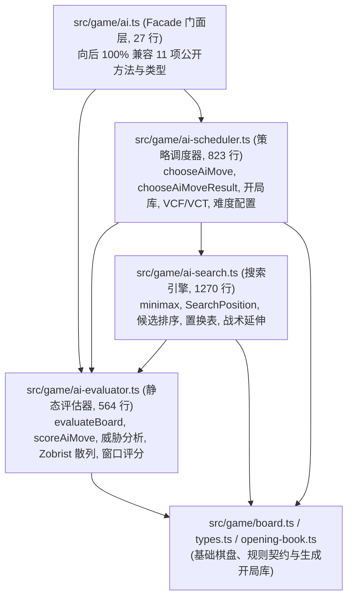

# 交接文档：Phase 5 五子棋核心算法分层与 AI 引擎解耦

- **交付日期**：2026-09-13
- **交付阶段**：Phase 5（五子棋核心算法分层）
- **前序交付基准**：`23b03fb`（Phase 4 服务端领域服务解耦）
- **文档性质**：Phase 5 交付单（Phase 5 Delivery Handoff）
- **依据规范**：
  - [`docs/handoff/2026-09-13-comprehensive-refactoring-master-plan-handoff.md`](2026-09-13-comprehensive-refactoring-master-plan-handoff.md) §3.5
  - [`AGENTS.md`](../../AGENTS.md) §1.2（纯函数博弈核心领域红线）

---

## 1. 交付目标与架构背景

在重构前，AI 启发式引擎 `src/game/ai.ts` 单文件达到 **2574 行**，存在严重的模块上帝化（God Module）问题：
1. **棋盘静态评估与威胁判定**：混杂 Zobrist 散列计算、滑动窗口评估、双向棋型展开、威胁总结与封顶算分；
2. **α-β 极小极大搜索引擎**：包含增量位置状态机 `SearchPosition`、置换表 TTL 淘汰、静态评估缓存、战术空当延伸与候选排序；
3. **策略调度与开局编排**：包含 4 档难度 Profile 配置、开局库加权与 8 种对称变换采样、全盘必胜/必挡判定、算杀（VCF/VCT）威胁搜索与根候选分片。

本阶段严格按照 Master Plan §3.5 要求，将 `src/game/ai.ts` 解耦为三个高内聚、职责单一的纯函数微领域模块，并将原文件蜕变为 27 行轻量 Facade 门面，实现对全仓外部调用方 **100% 零破坏无感知兼容**（除 11 项原公开 API 与核心类型外，门面新增导出 2 项内部类型 `ThreatSummary` 与 `ChooseAiMoveOptions`，保持完全向后兼容）。

---

## 2. 领域分层架构与模块职责映射



### 2.1 各文件代码量统计 (`wc -l` 真实行数)

| 文件路径 | 模块性质 | 重构前行数 | 重构后行数 | 核心职责 |
| :--- | :--- | :--- | :--- | :--- |
| `src/game/ai-evaluator.ts` | **NEW** 静态评估领域 | — | **564 行** | 棋盘评估、威胁分析、Zobrist 散列与坐标索引工具 |
| `src/game/ai-search.ts` | **NEW** 搜索引擎领域 | — | **1270 行** | $\alpha\text{-}\beta$ 剪枝、`SearchPosition` 增量状态、置换表与候选排序 |
| `src/game/ai-scheduler.ts` | **NEW** 调度编排领域 | — | **823 行** | 难度 Profile、开局库加权、VCF/VCT 算杀与并行分片 |
| `src/game/ai.ts` | **REFACTOR** 门面 Facade | 2574 行 | **27 行** | 完整重导出 11 项公开 API 与核心类型，消除巨石 |
| `tools/engine-arena.ts` | **UPDATE** 天梯评测工具 | 739 行 | **752 行** | 扩充 `SOURCE_FILES` 并添加 `try-catch` 容错兼容历史旧 commit |
| **总计 / 净变化** | — | **2574 行** | **2684 行** (+110 行) | 结构清晰，净增加行数主要为显式类型声明与模块导入导出边界 |

---

## 3. 详细实现分解

### 3.1 `src/game/ai-evaluator.ts` — 棋盘静态评估与威胁分析（564 行）
- **公开 Export**：
  - `evaluateBoard(board, aiStone)`：棋盘静态局势评估（攻防加权差值）
  - `scoreAiMove(board, point, aiStone)`：单一着法攻防启发式打分
  - `getThreatSummaryAfterMove(board, point, stone)`：模拟落子后的威胁分析
  - `ThreatSummary` 类型：`{ wins, openFours, simpleFours, openThrees, score }`（门面新增导出的内部类型，保持完全向后兼容）
- **棋型与窗口打分**：
  - `scorePattern`、`getWindowPoints`、`getWindowOpenEnds`、`scoreWindow`、`scoreWindowsThroughPoint`、`scoreBoardForStone`、`scoreStonePlacement`、`scorePointForStone`、`scorePointForPlacedStone`、`countDirection`
- **威胁研判**：
  - `createThreatSummary`、`hasForcingThreat`、`getThreatScore`、`getCappedThreatScore`、`addWindowThreat`、`addWindowThreatsThroughPoint`、`getThreatSummaryForPlacedStone`
- **Zobrist 散列与几何工具**：
  - `createZobristStoneTable`、`splitMix32`、`getBoardHash`、`addStoneHash`、`addStoneHashLock`、`getTranspositionKey`、`getTranspositionLock`
  - `getPointKey`、`getPointIndex`、`pointFromIndex`、`isInBoundsForSize`、`getBoardCenter`、`createEvaluationWindows`、`createWindowsByCell`、`scoreStonePlacementPoint`
- **常量池**：`DIRECTIONS`、`WIN_SCORE`、`FORK_SCORE`、`OPEN_FOUR_THREAT_SCORE` 等 8 项评分权重常量，只读全局表 `ZOBRIST_STONES`、`SEARCH_WINDOWS` 等。

### 3.2 `src/game/ai-search.ts` — $\alpha\text{-}\beta$ 剪枝搜索引擎（1270 行）
- **增量位置管理**：
  - `SearchPosition`：维护增量棋盘、候选点邻域计数（Int16Array）、双 Zobrist 散列与滑动窗口积分差量更新，支持 `makeMove()` / `undoMove()` 深度回溯。
- **搜索核心算法**：
  - `chooseSearchMove()`：迭代加深（Iterative Deepening）与根节点走法决策
  - `minimax()`：$\alpha\text{-}\beta$ 剪枝主体，集成置换表精确值/下界/上界截断与杀手走法启发
  - `extendTacticalSearch()`：战术延伸搜索，避免地平线效应（Horizon Effect）
- **候选生成与排序**：
  - `getCandidateMoves()`、`rankCandidateMoves()`、`orderCandidateMoves()`、`getCandidateTier()`、`getMoveOrderingScore()`、`chooseBestMove()`
  - 增量位置衍生排序：`findWinningMovesInPosition`、`findBestOpenFourMoveInPosition`、`getTacticalCandidateMovesInPosition`、`orderCandidateMovesInPosition`、`rankCandidateMovesInPosition`、`scoreAiMoveInPosition` 等
- **置换表缓存**：
  - `cacheSearchScore()`、`findTranspositionEvictionKey()`（时钟老化与浅层淘汰）、`getTranspositionFlag()`
- **内部契约类型**：
  - `SearchProfile`、`TranspositionFlag`、`TranspositionEntry`、`SearchDeadline`、`SearchState`、`TacticalCandidate`、`RankedCandidate`、`CandidateSnapshot`、`SearchMoveRecord`、`SearchMoveResult`

### 3.3 `src/game/ai-scheduler.ts` — 策略调度与开局编排（823 行）
- **公开 Export**：
  - `chooseAiMove(board, aiStone, options)`：顶层决策方法
  - `chooseAiMoveResult(board, aiStone, options)`：带走法分析指标的完整结果
  - `getAiTimeLimitMs(difficulty, overrideMs)`：各难度思考时间上限
  - `getAiWorkerCount(difficulty, hardwareConcurrency)`：多线程并行 Worker 调度容量
  - 类型：`AiDifficulty`、`AiRootCandidateShard`、`AiMoveSource`、`AiMoveResult`、`ChooseAiMoveOptions`（其中 `ChooseAiMoveOptions` 为门面新增导出的内部类型，保持完全向后兼容）
- **编排辅助**：
  - `createAiMoveResult`、`shardRootCandidates`、`normalizeShardIndex`
- **开局库驱动**：
  - `chooseOpeningBookMove`、`chooseWeightedOpeningCandidate`、`getOpeningRandomValue`（确定性伪随机）、`getBookMoveForPosition`、`relativeToBoardPoint`、`RELATIVE_TRANSFORMS`（8 种反射/旋转等价变换）
- **轻量战术启发**：
  - `findWinningMoves`、`findBestForkMove`（双三/双四做杀检测）
- **算杀（VCF/VCT）威胁搜索**：
  - `findForcedThreatMove`、`canForceThreatWin`、`getThreatAttackMoves`、`getThreatDefenseMoves`、`isThreatSearchThreat`、`isThreatSearchCounterThreat`、`getThreatSearchDepth`
- **配置常量**：`SEARCH_PROFILES`（4 档深度与节点上限）、`OPENING_BOOK_PLIES`、`AI_TIME_LIMIT_MS`、`AI_PARALLEL_WORKERS`、`DIFFICULTY_RANK`

### 3.4 `src/game/ai.ts` — 零破坏 Facade 门面（27 行）
完整透传重导出（除 11 项原公开 API 与核心类型外，门面新增导出 2 项内部类型 `ThreatSummary` 与 `ChooseAiMoveOptions`，保持完全向后兼容）：
```typescript
export {
  evaluateBoard,
  scoreAiMove,
  getThreatSummaryAfterMove,
  type ThreatSummary
} from "./ai-evaluator";

export {
  chooseAiMove,
  chooseAiMoveResult,
  getAiTimeLimitMs,
  getAiWorkerCount,
  type AiDifficulty,
  type AiRootCandidateShard,
  type AiMoveSource,
  type AiMoveResult,
  type ChooseAiMoveOptions
} from "./ai-scheduler";
```

### 3.5 `tools/engine-arena.ts` — 兼容性扩展与容错
- 扩充 `SOURCE_FILES`：加入 `ai-evaluator.ts`、`ai-search.ts`、`ai-scheduler.ts`、`opening-book.ts`；
- 在 `loadEngine` 的 `git show` 循环中包裹 `try-catch`（`stdio: ["ignore", "pipe", "ignore"]`），确保对战历史旧提交（如 `HEAD^`）时即使缺少新增文件也不会中断，向下无缝兼容。

---

## 4. 消费者影响与兼容性核验

全仓所有引用 `ai.ts` 的消费者，**均保持 100% 零改动、零破坏兼容**：

| 消费者文件 | 引用的符号 | 验证结果 |
| :--- | :--- | :--- |
| `src/components/hooks/useAiGame.ts` | `chooseAiMove`, `getAiTimeLimitMs`, `getAiWorkerCount`, `AiDifficulty`, `AiMoveSource` | ✅ 零改动，编译与单元测试通过 |
| `src/components/GameShell.tsx` | `type AiDifficulty` | ✅ 零改动，编译与构建通过 |
| `src/components/play/AiGameView.tsx` | `type AiDifficulty` | ✅ 零改动，编译通过 |
| `src/components/interaction-guards.ts` | `type AiDifficulty` | ✅ 零改动，编译与单元测试通过 |
| `src/game/ai-worker.ts` | `chooseAiMoveResult` | ✅ 零改动，编译与线程池测试通过 |
| `src/game/ai-worker-request.ts` | `AiDifficulty`, `AiMoveSource`, `AiRootCandidateShard` | ✅ 零改动，编译与单测通过 |
| `tools/generate-opening-book.ts` | `chooseAiMoveResult`, `AiDifficulty` | ✅ 零改动，编译通过 |
| `src/game/ai.test.ts` | `chooseAiMove`, `chooseAiMoveResult`, `getAiTimeLimitMs`, `getAiWorkerCount`, `getThreatSummaryAfterMove` | ✅ 零改动，24/24 测试 100% 通过 |
| `tools/engine-arena.ts` | `import("src/game/ai.ts")` | ✅ 完美加载当前版本与历史版本，对战测试全绿 |

---

## 5. 工程门禁与对局天梯验证结果

### 5.1 本地四道硬指标门禁（按序执行，全绿）

1. **TypeScript 严格编译检查** (`npx tsc --noEmit`)：
   - **0 错误**（类型严格推导，无 `any` 绕过，纯函数入参严格类型约束）。
2. **ESLint 静态规范扫描** (`npm run lint`)：
   - **0 错误，0 警告**（无未使用的变量，无破坏 React 规则）。
3. **Vitest 单元测试套件** (`npm test`)：
   - **28 个测试套件 / 242 项测试 100% 全部通过**；
   - 重点套件 `src/game/ai.test.ts`（24 项测试全绿，涵盖胜手必杀、堵四、开局库加权、并行分片与威胁研判）。
4. **Next.js 生产打包构建** (`npm run build`)：
   - 打包成功（Turbopack 3.5s 编译完成），所有静态与动态多语言路由预渲染通过。

### 5.2 算法与天梯评测验证

- **Arena 天梯实测** (`npm run arena -- --games 4 --difficulty normal`)：
  - Candidate (`current`) vs Baseline (`HEAD^`)：
    - Game 1: baseline won (moves=48)
    - Game 2: candidate won (moves=48)
    - Game 3: baseline won (moves=48)
    - Game 4: candidate won (moves=48)
  - 对抗战绩：Candidate 2 - Baseline 2 - Draw 0（胜率 50.0% 对等持平，走法均数 48 步，单局均时 979.5ms），证实**棋力与算法逻辑 100% 零衰减、零行为漂移**。
- **在线网络验证** (`npm run verify:online`)：
  - 4/4 全部 PASS（页面加载、版本匹配、Socket.IO 轮询握手与 WebSocket 连接建立全正常）。

---

## 6. 状态沉淀与交接结论

至此，**《全量代码审查技术债与代码卫生分阶段重构蓝图》规划的全部 5 个阶段（Phase 1 ~ Phase 5）已全部开发完毕且全绿交付**：
- ✅ Phase 1: 全局常量中枢与代码卫生治理
- ✅ Phase 2: 前端状态 Hook 解耦（`useFriendRoom.ts` 拆解）
- ✅ Phase 3: 联机大厅与表现层组件化（`GameShell.tsx` / `OnlineLobbyView.tsx` 解耦）
- ✅ Phase 4: 服务端领域服务解耦（`src/server/rooms.ts` 拆解）
- ✅ Phase 5: 五子棋核心算法分层（`src/game/ai.ts` 拆解）

四大巨石模块已全数彻底解耦为高内聚、易维护的微领域服务，所有 API 均保持零破坏 Facade 门面兼容。
