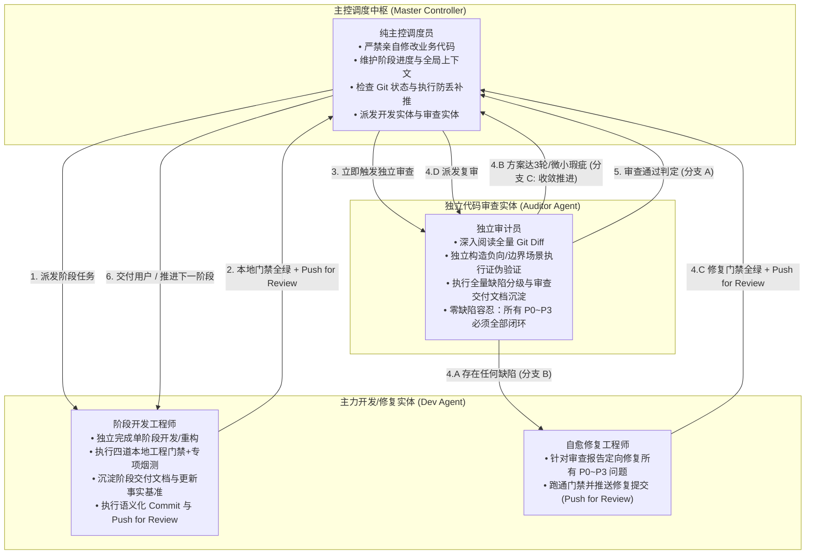

# 双智能体全自主重构与零缺陷审查协同工作流规范 (Dual-Agent Autonomous Refactoring Workflow Template)

> 本规范是基于 **Antigravity** 与 **Tencent WorkBuddy** 构建的全自主、可自愈、零缺陷容忍的代码开发、重构与交付流程标准规范。

---

## 1. 标准工程生命周期状态机 (Lifecycle State Machine)

```
开发/修复 ⟶ 本地门禁 ⟶ 提交推送 ⟶ 立即触发审查 ⟶ 等待判定 ⟶ [自愈循环] ⟶ 审查通过/熔断 ⟶ 向用户交付
```

### 【核心原则：流程强绑定与消除歧义】
1. **Push for Review，非终态**：`git push` 仅代表代码完成本地阶段开发与自测、正式提交送审（Push for Review），**绝非任务交付终态**。
2. **审查闭环为交付必经阶段**：任何代码推送到远端后，主控智能体必须**立即、无缝触发 WorkBuddy 独立审查**并挂起等待判定，严禁在未收到审查通过判定前向用户宣称任务完成或终止执行流程。
3. **免人工干预自愈闭环与分级治理**：若审查指出任何缺陷（P0~P3），自动进入修复与复审自愈循环：
   - **纯技术方案/文档审查**（改动仅涉及 docs/markdown）：严格限制最多 3 轮（`Round <= 3`），达到第 3 轮强制收敛定稿，直接推进至源码实现与测试；
   - **真实代码实现审查**：维持最高 10 轮高强度对抗自愈循环，直至 100% 零缺陷闭环。

---

## 2. 架构定位与角色模式 (Role Modes)

| 模式 | 主力开发 / 修复 (Dev) | 独立审查员 (Auditor) | 适用场景 |
| :--- | :--- | :--- | :--- |
| **Mode A（标准正向流）** | Antigravity 子代理 | WorkBuddy | 复杂架构重构、单阶段代码改造、算法分层 |
| **Mode B（反向代理流）** | WorkBuddy | Antigravity 子代理 | 独立脚本开发、工具链改造、专项探索 |

- **总控中枢 (Master Controller)**：由 Antigravity 担任，负责纯调度、状态机推进、全局事实基准维护与 Git 安全守护，严禁直接代行主力开发或审查职责。



---

## 3. 主力开发工程师标准提示词模板 (Developer Prompt)

派发主力开发实体时，主控智能体严格使用以下提示词框架：

```markdown
你现在是专门负责 [项目名称] 的【Phase {PHASE_NUM} 独立开发与验证工程师】。
你的工作目录是：{WORKSPACE_CWD}

你的核心任务：严格按照任务设计与交付蓝图【Phase {PHASE_NUM}: {PHASE_TITLE}】的要求，完成该阶段所有代码改造、消除技术债、收敛前序审查建议、跑通全套工程门禁、沉淀阶段交接文档，并执行 Git 提交推送（Push for Review）。请直接进入执行状态，不要停留在 Planning 状态等待确认。

具体执行清单：
1. 阅读交接与上下文：查阅总纲交接文档与前序审查报告中指出的遗留建议。
2. 落实核心代码开发/重构：
   - 保证对外公开 API 与消费组件 100% 契约兼容，零破坏性。
3. 执行本地工程四道门禁 + 专项烟测（必须依次全绿通过）：
   - 门禁 1: `npx tsc --noEmit`（0 错误，严格类型）
   - 门禁 2: `npm run lint`（0 错误，0 警告）
   - 门禁 3: `npm test`（测试套件 100% 通过）
   - 门禁 4: `npm run build`（生产构建完全成功）
   - 专项烟测：[如 verify:online, smoke:lobby, arena 等]
4. 交付沉淀与 Git 送审推送（Push for Review）：
   - 生成交付单 `docs/handoff/{DATE}-phase{PHASE_NUM}-{TITLE}-handoff.md`；
   - 更新 `docs/handoff/INDEX.md` 顶部索引；
   - 刷新 `STATUS.md` 的当前最新提交 SHA、测试用例数及里程碑指标；
   - 确认工作区干净，执行规范提交：`feat(refactor): phase {PHASE_NUM} - {MESSAGE}`；
   - 执行 `git push origin {BRANCH}` 推送至远端（此为送审动作，非最终交付）；
   - 向主控详细汇报：提交 SHA、推送结果、文件清单与门禁数据。
```

---

## 4. 独立审查员标准提示词与规范 (Auditor Protocol)

### 4.1 派发调用契约（严格受控，杜绝外部噪声）
- **规范模板文件**：`C:\Users\12915\.gemini\config\plugins\workbuddy-plugin\skills\workbuddy-bridge\code-review-prompt.md`
- **派发调用约定**：
  必须直接引用上述规范模板，**仅允许替换模板中的 6 个占位符**（`{GOAL}`, `{ACCEPTANCE_CRITERIA}`, `{BASE_SHA}`, `{HEAD_SHA}`, `{SCOPE}`, `{KNOWN_LIMITATIONS}`），严禁额外添加任何非标准提示词。
- **实体调用参数**：
  - **Mode A（WorkBuddy 审查）**：调用 CLI 或 MCP 派发，参数显式绑定 `--cwd "{WORKSPACE_CWD}"`，优先模型 `deepseek-v4.1-flash`（备用 `glm-5.3-flash`），超时 `--timeout 3600`，权限配置 `--permission-mode bypassPermissions`。
  - **Mode B（Antigravity 审查）**：调用 `invoke_subagent` 派发只读审查实体，以相同模板执行全量 diff 审查与证伪验证。

### 4.2 审查通过标准（零缺陷容忍原则）
> **核心硬指标**：所有审查发现的问题，**无论严重级别大小（包括 P3 与文档事实偏差），均必须 100% 彻底修复闭环**。严禁遗留任何级别缺陷进入下一阶段或向用户交付。

### 4.3 审查交付物去噪规范（核心聚焦缺陷）
- **去噪原则**：审查交接单（Handoff）禁止大篇幅铺陈“通过项”、“正常调用链推导”或“全部通过的测试用例日志与表格”。通过项严格控制在 10 行以内极简概括。
- **篇幅分配**：交付文档 90% 以上篇幅必须 100% 聚焦于发现的问题（P0~P3 缺陷的行号、触发条件、根因分析、证伪复现证据与修复建议）。

---

## 5. 缺陷自愈修复工程师标准提示词模板 (Self-Healing Fixer Prompt)

当审查实体提出任何级别（P0~P3）缺陷并推送审查文档后，主控智能体派发修复实体：

```markdown
你现在是专门负责 [项目名称] 的【Phase {PHASE_NUM} 缺陷自愈修复工程师】。
你的工作目录是：{WORKSPACE_CWD}

你的核心任务：严格依照 Round {ROUND_NUM} 独立审查交接单 `docs/handoff/{DATE}-code-review-round{ROUND_NUM}-handoff.md`，对审查发现的全部缺陷（包括 P0/P1/P2/P3 及事实校准项）进行 100% 定向修复闭环，通过全量本地工程门禁并推送到远端（Push for Review）。请直接进入执行状态，不要停留在 Planning 状态等待确认。

具体执行清单：
1. 深入核实审查单中列出的全部缺陷（逐项核实代码位置、根因与建议）；
2. 逐一实施针对性修复代码，补齐缺失逻辑或边界守卫，消除孤儿键与死代码；
3. 补充针对该缺陷的有效测试断言，确保回归不会再次发生；
4. 严格校对 `STATUS.md` 与交付单中的文件行数（以 `wc -l` 为准）与当前最新 commit SHA；
5. 运行四道本地工程门禁（tsc, lint, test, build）与专项烟测，确保全绿；
6. 检查工作区干净后，执行规范提交：`fix(refactor): resolve round {ROUND_NUM} review findings and converge all P0-P3 items`；
7. 执行 `git push origin {BRANCH}` 推送至远端送审；
8. 向主控汇报修复提交 SHA、修改细节与验证结果。
```

---

## 6. 主控自动化 Git 守护机制 (Git Safety Protocol)

主控智能体在每个阶段或自愈轮次节点，必须执行严格的 Git 状态三步校验：
1. **工作树干净检查**：`git status -sb` 必须确认无未暂存或未跟踪文件；
2. **提交与推送核验**：检查当前 HEAD SHA 是否领先远端；若开发或审查实体由于异常中断未能执行推送，主控必须立即自动补齐 `git push origin {BRANCH}`；
3. **基准与待审对齐**：记录精确的 `BASE_SHA` 与 `HEAD_SHA`，供下一审查环节严格比对；跨阶段推进前先执行 `git pull --ff-only` 保证本地工作区与远端无缝同步。

---

## 7. 反馈决策与分级自愈循环规范 (Resolution Loop & Safety Fuse)

主控智能体根据审查员的审计反馈执行决策状态机：

1. **分支决策机制**：
   - **分支 A（审查通过）**：WorkBuddy 确认通过且无新增缺陷 handoff ➔ 审查闭环完成，向用户汇报最终成果或进入下一里程碑，流程结束。
   - **分支 B（发现缺陷）**：WorkBuddy 发现问题并推送了新 handoff ➔ 主智能体执行 `git pull --ff-only` 同步交接文档 ➔ 派发修复实体针对 handoff 修复代码并补充测试 ➔ 本地门禁全绿 ➔ `git commit` & `git push` ➔ 再次派发 WorkBuddy 复审（轮次计数 `N = N + 1`）。
   - **分支 C（方案收敛与推进代码，最多 3 轮上限）**：若当前属于纯技术方案/文档阶段审查（git diff 均为 `.md` / `docs/`），且复审已达到 3 轮上限，或审查报告中仅残留非代码级建议、伪代码变量绑定、纯文档/文书/笔误类轻微瑕疵，主控智能体必须果断判定方案收敛定稿，坚决终止文档复审循环，直接推进至源码实现与自动化测试落地阶段。
2. **安全熔断与分级轮次上限（Safeguard & Classified Round Limits）**：
   - **纯技术方案 / 架构调研 / 文档审查**：严格限制最多 3 轮（`Round <= 3`）。到第 3 轮强制收敛定稿并推进至开发阶段，严禁对非阻塞建议或措辞反复纠缠。
   - **真实代码实现审查**：最多允许 10 轮高强度对抗性自愈循环。达到 10 轮仍未通过再由人工介入裁决。

